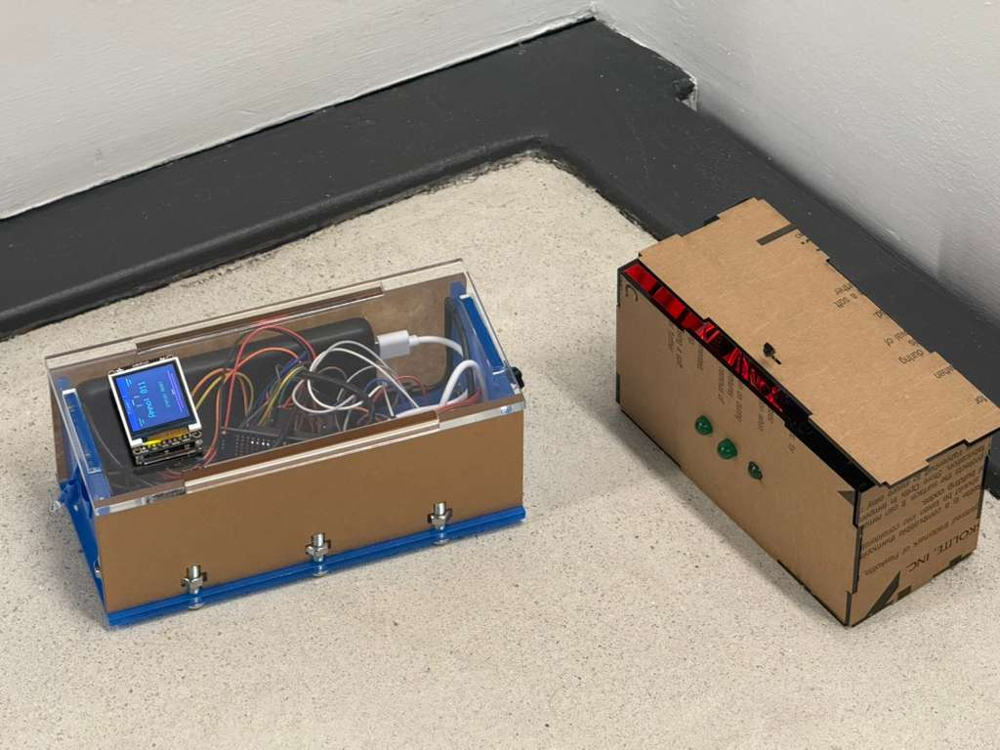
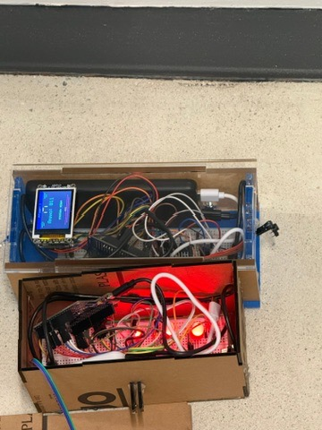
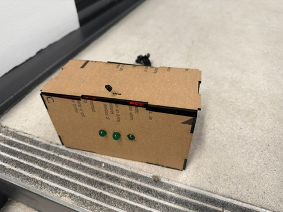
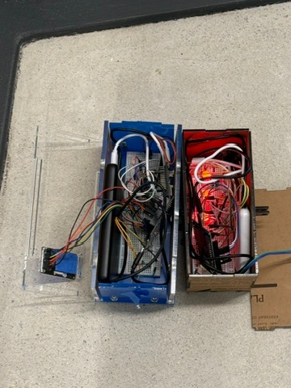

<h1 align="center">ESE 3500 - Friendly Fire</h1>

  <strong>Devan Malik</strong>
  <strong>Marko Mijatovic</strong>
  <strong>Kim Huang</strong>
  <strong>Victor Wanjohi</strong>

---

<h2 align="center">Description</h2>

  This project is a fully operational laser tag game with separate blaster and chest-mount
  components. The system is fully controlled through a web app, which includes a game dashboard
  for managing gameplay, tracking status, and monitoring the overall match experience.

---

<h2 align="center">Project Video</h2>

  

  <a href="https://drive.google.com/drive/folders/1jIbaAgMy6JAKm02dPGXfAoZNbYtTDbEu?usp=drive_link"><strong>Open the project video folder</strong></a>

---

<h2 align="center">Photos</h2>

<table align="center">
  <tr>
    <td align="center"></td>
    <td align="center"></td>
    <td align="center"></td>
    <td align="center"></td>
  </tr>
</table>

---

<h2 align="center">Specifications</h2>

### **SRS**

- **SRS 01:** The blaster firmware activates the IR LED for a duration of 0.5 seconds immediately after a valid trigger press is detected, ensuring that each shot produces a consistent and clearly identifiable output signal. This timing is controlled precisely in software so that every trigger event results in uniform LED behavior regardless of user input speed.

- **SRS 02:** The blaster firmware enforces a minimum inter-shot interval of 500 ms (±50 ms) to prevent excessive firing or spamming. During this cooldown period, any additional trigger inputs are ignored, and the system only re-enables firing once the interval has fully elapsed, ensuring consistent gameplay pacing and system reliability.

- **SRS 03:** The blaster firmware decrements the ammo counter each time a valid shot is fired and prevents any further firing once the ammo count reaches zero. The LCD display updates the visible ammo count within 100 ms of each shot, providing immediate feedback to the user and ensuring the displayed value always reflects the true internal state.

- **SRS 04:** The reload mechanic is implemented exclusively through a shake-to-reload gesture detected by the MPU6050 accelerometer. When a valid shake pattern is identified, the system initiates a reload sequence that restores the ammo count to its maximum value, providing a responsive and intuitive method for reloading without requiring button input.

- **SRS 05:** The vest firmware transmits updated player status information, including current health and elimination state, to the BLE module via UART within 500 ms of any change in game state. This ensures that external systems, such as a connected web application, receive timely and accurate updates reflecting in-game events.

- **SRS 06:** When a RESET command is received from the web application via BLE, both microcontrollers transition back to their initial ready state within 1 second. This reset restores full health, full ammo, and ALIVE status, ensuring the system is quickly ready for a new game session.

- **SRS 07:** The blaster firmware continuously reads acceleration data from the MPU6050 via I2C at a minimum sampling rate of 20 Hz. A shake-to-reload gesture is detected when acceleration exceeds 2g on any axis for at least three consecutive samples, at which point the system reliably triggers the reload sequence.

### **HRS**

- **HRS 01:** The IR emitter circuit uses an NPN transistor to drive a 940 nm IR LED at approximately 50 mA, generating a signal that can be reliably detected by a TSOP38238 receiver at a minimum range of 3 meters under typical indoor lighting conditions.

- **HRS 02:** The vest incorporates at an IR receiver modules positioned to provide both front hit detection coverage, ensuring consistent detection.

- **HRS 03:** The LCD display ST7735 is clearly visible to the player under normal indoor lighting conditions and updates at a minimum refresh rate of 5 frames per second to reflect current game state information such as ammo.

- **HRS 04:** A Feather ESP-based microcontroller system is used to handle wireless communication with the web application, maintaining a stable connection and enabling reliable transmission of game state data within typical indoor operating distances of up to 5 meters.

- **HRS 05:** A piezo buzzer on the blaster provides clear and audible feedback at a minimum of 65 dB measured at 30 cm, with distinct tones corresponding to events such as firing, reload completion, and no ammo.

- **HRS 06:** The blaster and vest are each powered by USB power banks supplying 5V directly, with a minimum capacity of 5000 mAh to support at least 60 minutes of continuous gameplay without requiring recharge.

- **HRS 07:** Each ATmega328PB operates at 16 MHz with a regulated 5V supply, and each MCU includes a 100 nF ceramic decoupling capacitor across VCC to filter high-frequency noise; the total current draw per subsystem does not exceed 500 mA during normal operation.

- **HRS 08:** The vest includes a visual feedback system consisting of three LEDs that indicate the player’s remaining lives, with the number of illuminated LEDs decreasing by one for each valid hit until all lives are depleted; the LEDs are clearly visible from at least 2 meters under standard indoor lighting.

---

<h2 align="center">Conclusion</h2>

  This project was a successful end-to-end build, and we are satisfied with the final system. We were able to meet all of our hardware and software requirements, and the blaster–vest system functions reliably in gameplay. Throughout the process, we learned how to integrate multiple subsystems—microcontrollers, sensors, IR communication, and user feedback—into a cohesive embedded system, as well as how to debug issues that arise when moving from isolated components to a fully integrated design.
Several aspects of the project went particularly well. We are proud of achieving a fully working system that includes real-time interaction, reliable hit detection, and responsive user feedback. The shake-to-reload mechanism, IR detection, and overall gameplay loop all came together in a way that demonstrates strong system-level design and implementation. We also gained valuable experience working through the full engineering cycle, from prototyping on breadboards to attempting a more finalized physical build.
At the same time, we encountered challenges that required us to adjust our approach. We had unexpected issues with getting the LED to function consistently, which slowed progress and limited how much time we could dedicate to refinement. Additionally, transitioning from a controlled lab bench setup to a physical enclosure introduced new problems related to wiring stability and robustness that we had not fully anticipated. These obstacles highlighted the importance of designing for reliability early and testing under more realistic conditions sooner.
If we were to approach this project again, we would prioritize earlier integration and enclosure testing, along with cleaner wiring and more modular design practices. With more time, we would focus on polishing the physical build, improving durability, and making the system more visually clean and robust. We do wish we had been able to reach that level of refinement, and we recognize that early setbacks—particularly with the LED—limited our ability to fully realize the system’s potential.
As a next step, this project could be expanded by improving the enclosure design, enhancing robustness for extended use, and adding additional gameplay features such as more advanced scoring, networking capabilities, or expanded player interaction. Overall, this project was a valuable and rewarding experience that strengthened both our technical skills and our ability to manage and execute a complex engineering system.

